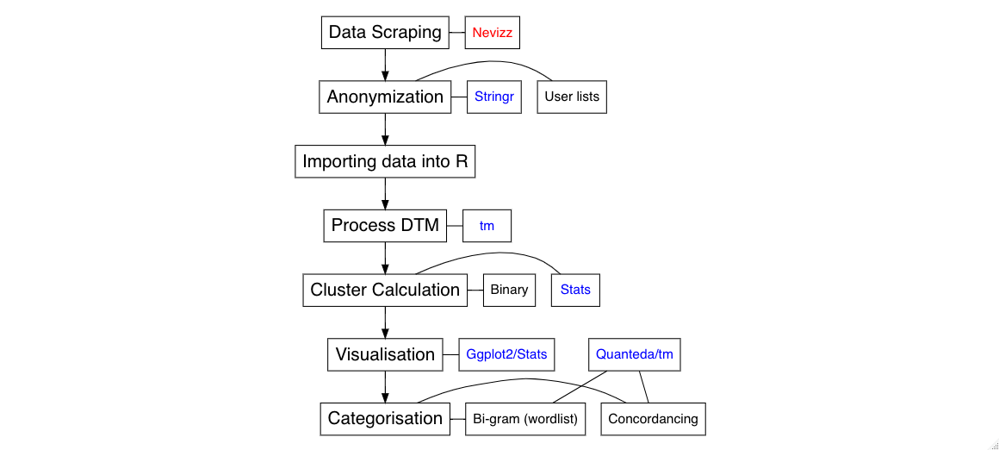
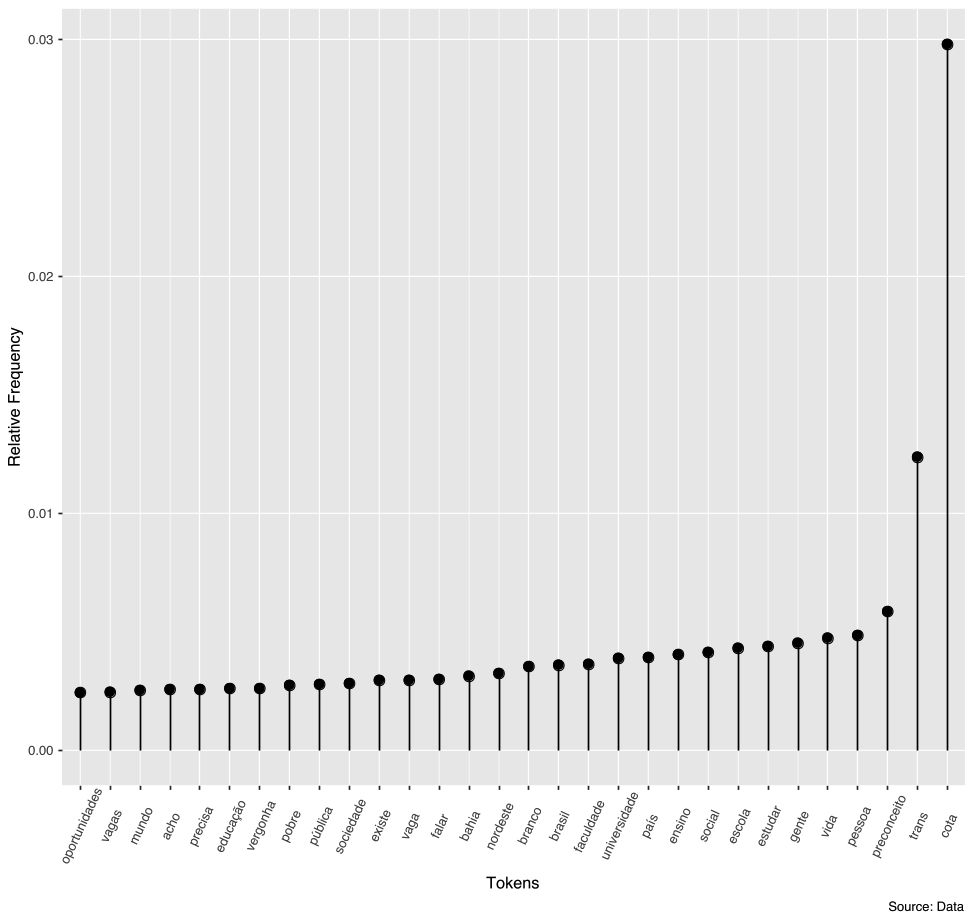
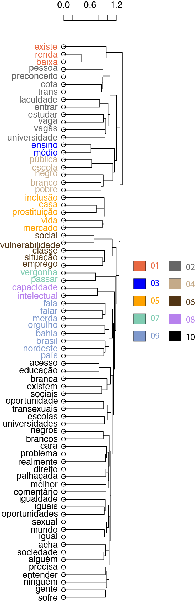

# Script for the Article

> Lima-Lopes, Rodrigo Esteves de. ‘Reactions to Social Quotas: A Study of Facebook Comments in Brazilian Portuguese’. *Revista da ABRALIN*, Dec. 2020, pp. 211–39, doi:10.25189/rabralin.v19i3.1703.

The article is available [here](https://revista.abralin.org/index.php/abralin/article/view/1703)

**Rodrigo Esteves de Lima Lopes** \
*Campinas State University*  \
[rll307@unicamp.br](mailto:rll307@unicamp.br)

## Thank you note

I would like to thank CNPq for financing this project.

# Introduction
I hope this script is useful for researchers in fields of linguistics and applied linguistics. Unfortunately due to regulations form the ethic research committee, I am unable to provide my data (actual comments and their classification). However, the article explains all classification and a link for the post is available (see bellow).

If you have any further questions, please feel free to drop me a line.

# Data scraping

The data in this article were collect from a post by [Quebrando o Tabu's Facebook](https://www.facebook.com/quebrandootabu/) page. **Quebrando o Tabu** is an independent news media agency in Brazil.

Unfortunately, the tool used for data collection, *Netvizz*, is no longer
working because of Facebook’s new policies. Today an alternative would
be [Facepage](https://github.com/strohne/Facepager).

## Criteria for scraping data

1. The comments were scraped form Quebrando o Tabu's Facebook](https://www.facebook.com/quebrandootabu/) page;
1. I scraped comments 24 hours after the post. Please, note that some comments might be deleted due to users' intervention.

# Scripts for data analysis

Each of the script on this repository is relative to a different part of the research. The function of file is listed here:

1. `Dendrogram`: Binary and dendrogram calculation/Binary and dendrogram plotting
1. `Wordlist`: Word listing and plotting Wordlists
1. `Concordancing`: Creating KWIC

## Research flowchart

## Dendrogram and graphics

Here are dendrogram and some graphics used in the article

