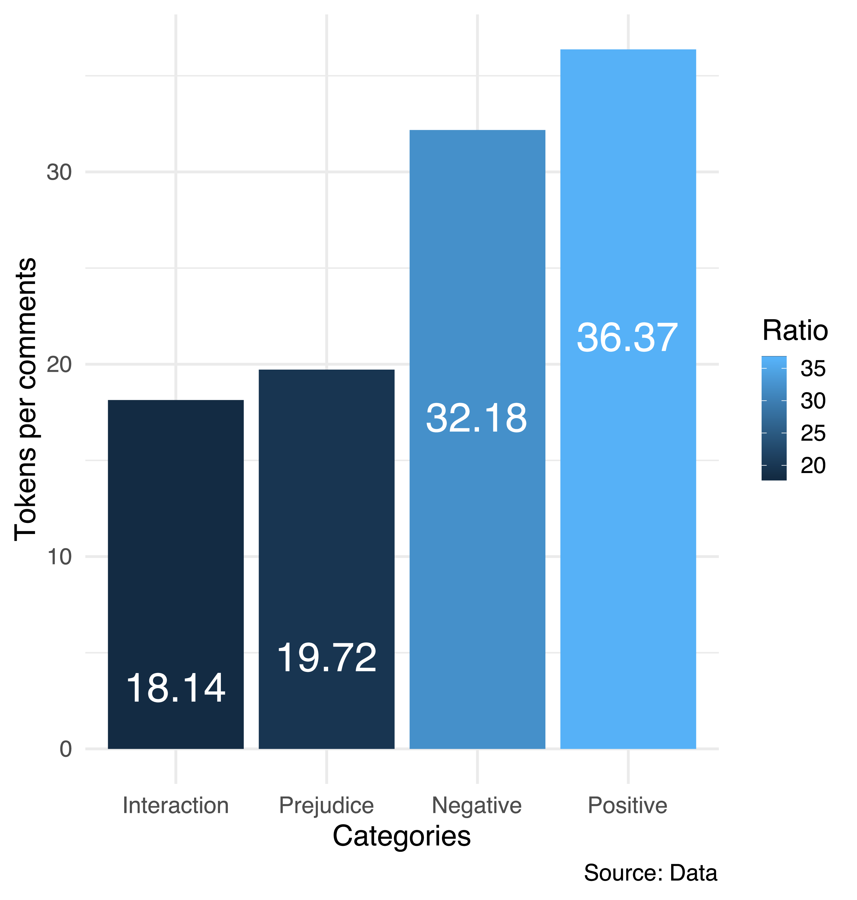

# Script for the Article

> Lima-Lopes, Rodrigo Esteves de. ‘Reactions to Social Quotas: A Study of Facebook Comments in Brazilian Portuguese’. *Revista Da ABRALIN*, Dec. 2020, pp. 211–39, doi:10.25189/rabralin.v19i3.1703.

The article is available [here](https://revista.abralin.org/index.php/abralin/article/view/1703)

**Rodrigo Esteves de Lima Lopes** \
*Campinas State University*  \
[rll307@unicamp.br](mailto:rll307@unicamp.br)

## Thank you note

We hope this script is useful for researchers in fields of linguistics and applied linguistics. Unfortunately due to regulations form the committee for research ethics, we cannot provide data in this repository. If you have any further questions, please feel free to drop us a line. I would like to thank CNPq for financing this project.

# Data scraping

The data in this article were collect from a post by [Quebrando o Tabu's Facebook](https://www.facebook.com/quebrandootabu/) page. **Quebrando o Tabu** is an independent news media agency in Brazil.

Unfortunately, the tool used for data collection, *Netvizz*, is no longer
working because of Facebook’s new policies. Today an alternative would
be [Facepage](https://github.com/strohne/Facepager).

## Criteria for scraping data

1. The comments were scraped form the [post](https://www.facebook.com/quebrandootabu/posts/2311997132189994);
1. I scraped comments 24 hours after the post. Please, note that some comments might be deleted due to users' intervention.

# Scripts for data analysis

Each of the script on this repository is relative to a different part of the research. This function of file is listed here:

1. `Dendrogram`: Binary and dendrogram calculation/Binary and dendrogram plotting
1. `Wordlist`: Word listing and plotting Wordlists
1. `Concordancing`: Creating KWIC
1. `Comparison`: Calculating for t-test and plotting

## Research flowchart

## Dendrogram and graphics

Here are dendrogram and some graphics used in the article

